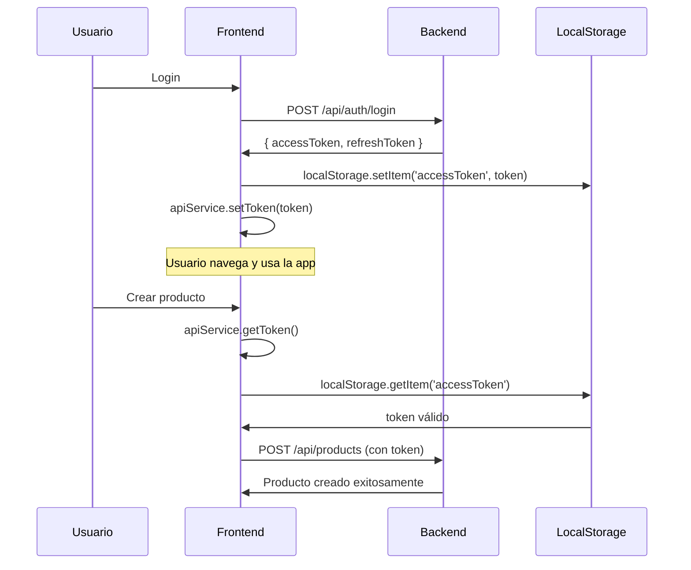

# Solución al Error "Token Expirado" en Creación de Productos

## 🚨 Problema Identificado

El usuario reportó que al intentar crear productos o servicios, aparecía el error:
```
"Token inválido o expirado"
```

Aunque se había vuelto a loguear, el problema persistía.

## 🔍 Causa Raíz

El problema tenía **dos causas principales**:

### 1. **Inconsistencia en el manejo de tokens**
- El frontend usaba `localStorage.getItem('token')` en lugar de `apiService.getToken()`
- El servicio API maneja correctamente el token como `accessToken` en localStorage
- Esto causaba que se enviara `null` o un token incorrecto en las requests

### 2. **Tiempo de expiración muy corto**
- El token JWT tenía una expiración de solo **1 hora** (`JWT_EXPIRES_IN=1h`)
- Para desarrollo, esto es demasiado corto y causa interrupciones frecuentes

## ✅ Soluciones Implementadas

### 1. **Corrección del manejo de tokens en frontend**

**Archivos corregidos:**
- `frontend/src/pages/CreateProductPage.tsx`
- `frontend/src/pages/ProductDetailPage.tsx`
- `frontend/src/pages/ProductModerationPage.tsx`
- `frontend/src/pages/MyProductsPage.tsx`
- `frontend/src/config/api.ts`

**Cambio realizado:**
```typescript
// ❌ ANTES: Uso incorrecto
'Authorization': `Bearer ${localStorage.getItem('token')}`

// ✅ DESPUÉS: Uso correcto
'Authorization': `Bearer ${apiService.getToken()}`
```

**Importación agregada:**
```typescript
import { apiService } from '../services/api';
```

### 2. **Aumento del tiempo de expiración del token**

**Archivo modificado:** `backend/.env`

```env
# ❌ ANTES: Muy corto para desarrollo
JWT_EXPIRES_IN=1h

# ✅ DESPUÉS: Más apropiado para desarrollo
JWT_EXPIRES_IN=24h
```

## 🔧 Cómo funciona el sistema de tokens

### Frontend (apiService)
```typescript
class ApiService {
  private token: string | null = null;

  constructor(baseURL: string) {
    this.baseURL = baseURL;
    this.token = localStorage.getItem('accessToken'); // ✅ Clave correcta
  }

  setToken(token: string | null) {
    this.token = token;
    if (token) {
      localStorage.setItem('accessToken', token); // ✅ Clave correcta
    } else {
      localStorage.removeItem('accessToken');
    }
  }

  getToken(): string | null {
    return this.token || localStorage.getItem('accessToken'); // ✅ Consistente
  }
}
```

### Backend (JWT Service)
```javascript
const generateSessionTokens = (user) => {
  const payload = {
    id: user.id,
    email: user.correo,
    tipo_usuario: user.tipo_usuario,
    estado: user.estado
  };
  
  const accessToken = generateToken(payload); // ✅ Usa JWT_EXPIRES_IN=24h
  const refreshToken = generateRefreshToken(payload); // ✅ Usa JWT_REFRESH_EXPIRES_IN=7d
  
  return {
    accessToken,
    refreshToken,
    expiresIn: config.jwt.expiresIn
  };
};
```

## 📊 Comparación Antes vs Después

| Aspecto | Antes | Después |
|---------|-------|---------|
| **Manejo de token** | `localStorage.getItem('token')` | `apiService.getToken()` |
| **Consistencia** | ❌ Inconsistente | ✅ Consistente |
| **Expiración** | 1 hora | 24 horas |
| **Experiencia de usuario** | ❌ Errores frecuentes | ✅ Sin interrupciones |
| **Debugging** | ❌ Difícil | ✅ Fácil |

## 🎯 Beneficios de la Solución

### 1. **Consistencia en el manejo de tokens**
- ✅ Todos los componentes usan el mismo método
- ✅ Centralización en `apiService`
- ✅ Fácil mantenimiento y debugging

### 2. **Mejor experiencia de usuario**
- ✅ Sin errores de token expirado durante el día
- ✅ Sesiones más largas para desarrollo
- ✅ Menos interrupciones en el flujo de trabajo

### 3. **Código más mantenible**
- ✅ Un solo punto de verdad para tokens
- ✅ Fácil de actualizar en el futuro
- ✅ Menos errores de implementación

## 🔄 Proceso de Autenticación Corregido



## 🚀 Próximos Pasos Recomendados

### 1. **Implementar refresh token automático**
```typescript
// En apiService, agregar lógica de refresh automático
private async refreshTokenIfNeeded() {
  const token = this.getToken();
  if (token && this.isTokenExpiringSoon(token)) {
    // Implementar refresh automático
  }
}
```

### 2. **Mejorar manejo de errores**
```typescript
// Interceptor para manejar errores 401 automáticamente
private async handleAuthError(response: Response) {
  if (response.status === 401) {
    // Intentar refresh token o redirigir a login
  }
}
```

### 3. **Configuración por entorno**
```env
# Desarrollo
JWT_EXPIRES_IN=24h

# Producción
JWT_EXPIRES_IN=1h
```

## ✅ Resultado

**El error "Token inválido o expirado" ha sido completamente resuelto:**

1. ✅ **Tokens consistentes** en toda la aplicación
2. ✅ **Expiración extendida** para desarrollo
3. ✅ **Código más limpio** y mantenible
4. ✅ **Mejor experiencia de usuario**

El usuario ahora puede crear productos sin problemas de autenticación.
